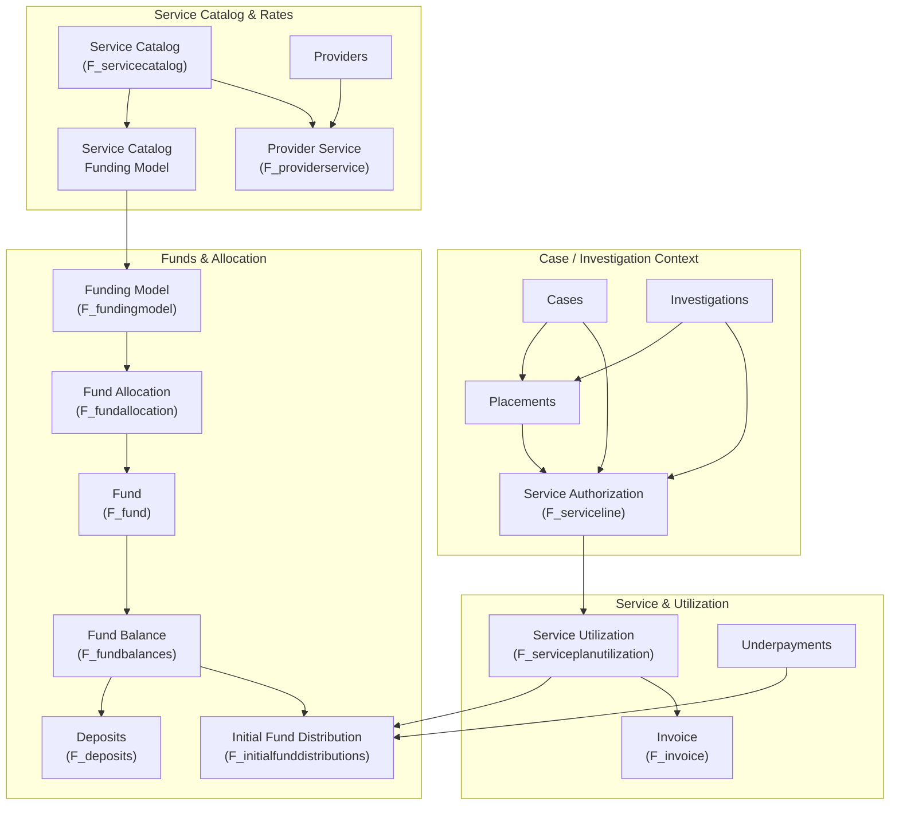
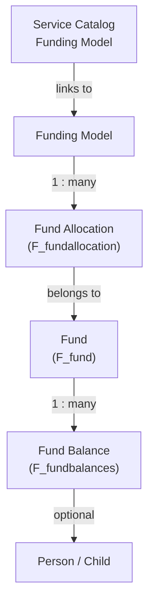
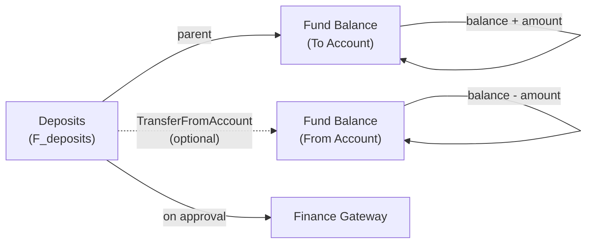
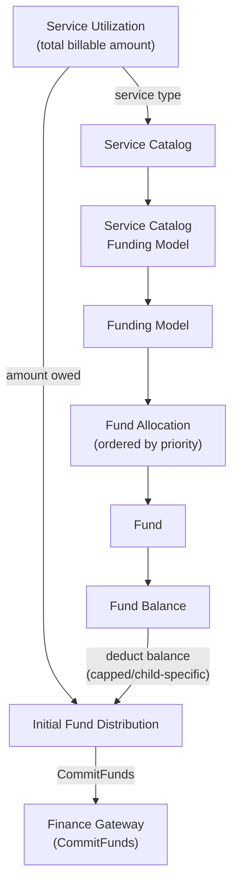
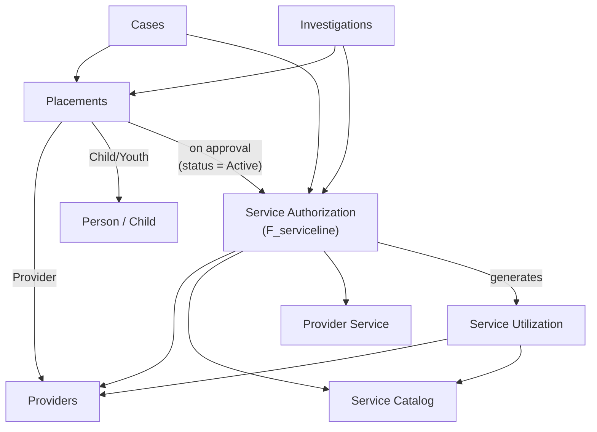
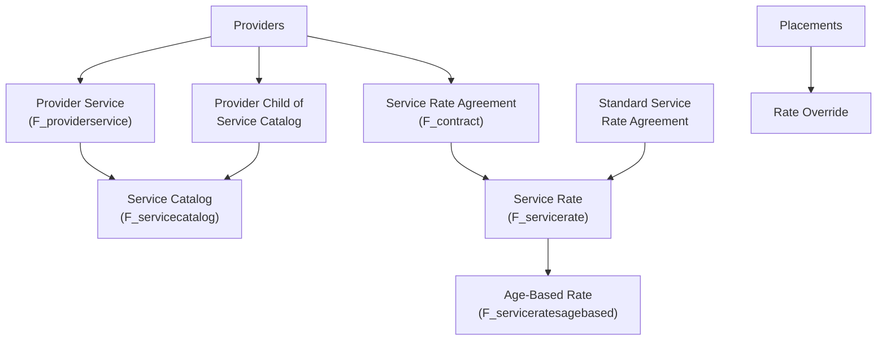
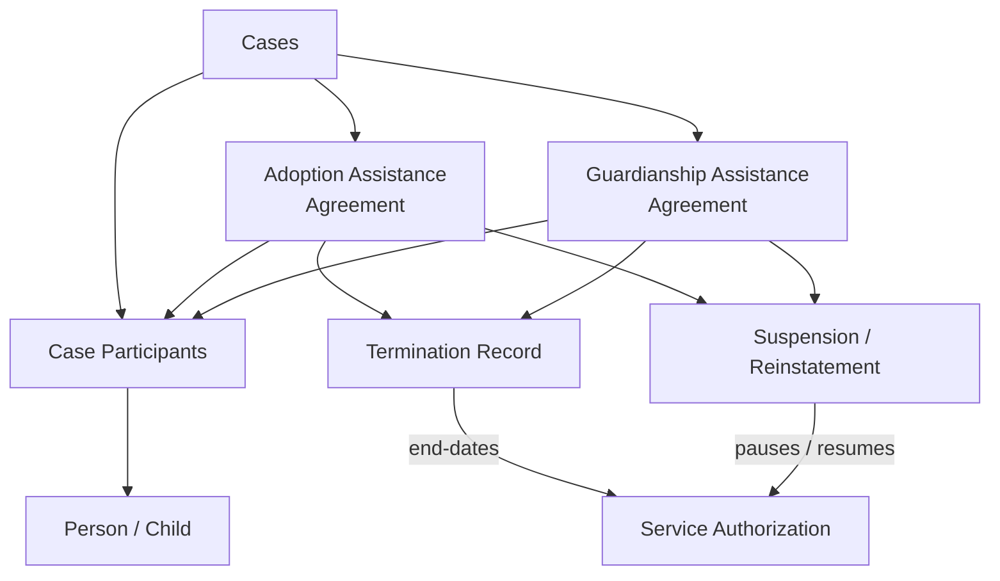
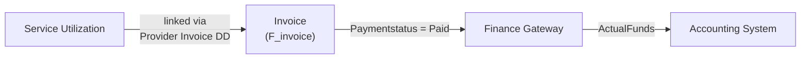
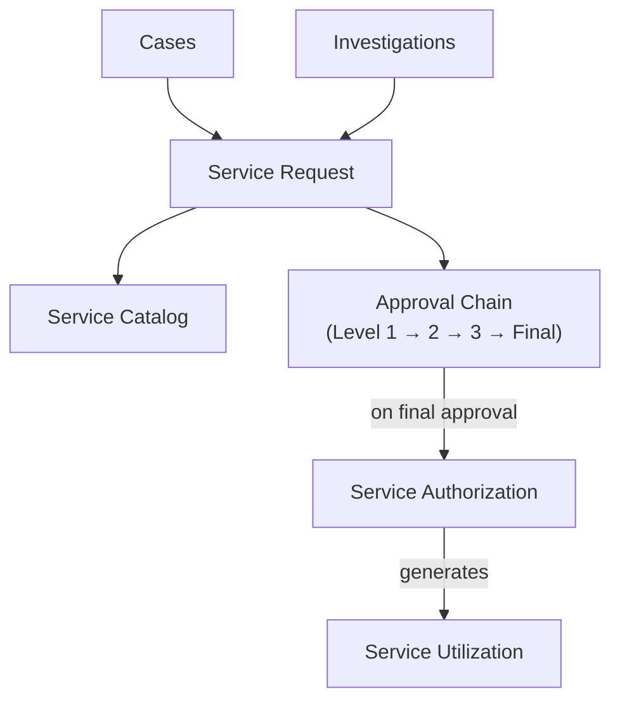

# Data Model Architecture

This page describes how the key entities in the Financials module relate to each other. Understanding these relationships helps trace data flow from placements and service utilization through to fund distribution and payment.

## Entity Relationship Overview

---

## Funds & Allocation Hierarchy

How funds are structured and allocated for payment.

### Entity Descriptions

| Entity | Purpose | Key Relationships |
|--------|---------|-------------------|
| **Fund** (`F_fund`) | Defines a funding source (e.g., State, IVE, SSI). Has `Cappedfund` and `Childspecificfund` flags. | Parent of Fund Balance; referenced by Fund Allocation |
| **Fund Balance** (`F_fundbalances`) | Holds the current balance for a fund. Can be child-specific (tied to a Person) or shared (capped fund). | Parent: Fund. Optional: Child. Children: Deposits |
| **Fund Allocation** (`F_fundallocation`) | Defines how much of a fund (percentage) pays for a service, with priority ordering and IVE eligibility flags. | Parent: Funding Model. References: Fund |
| **Funding Model** (`F_fundingmodel`) | Groups fund allocations for a funding period. | Children: Fund Allocations |
| **Service Catalog Funding Model** | Links a Service Catalog to a Funding Model for a date range (start/end dates are first/last of month). | Parent: Service Catalog. References: Funding Model |

### Fund Types

- **Capped Fund**: Shared pool with a finite balance. Balance is not child-specific. When a new capped fund is created, a Fund Balance record (with zero balance) is automatically created and a **CreateAccount** call is sent to the Finance Gateway.
- **Child-Specific Fund**: One balance per child (e.g., Child's Personal Account -- SSI, RSDI, Dedicated SSI Account). Fund Balances are created when a placement is approved.
- **Uncapped / Non-child-specific Fund**: No balance tracking needed; deposits are not allowed.

### IVE Eligibility on Fund Allocations

Fund allocations carry an `Iveeligible` flag that determines how they are processed during fund distribution:

| IVE Flag | Behavior |
|----------|----------|
| `Eligible` | Child must be IVE eligible; use standard percentage |
| `Reimbursable` | Child must be IVE reimbursable; apply maximum Title IV-E reimbursable amount from Service Catalog |
| `Reimbursable` + FMAP | Apply FMAP (Federal Medical Assistance Percentage) rate from CT FMAP code table |
| `Reimbursable` + Tribal FMAP | Apply Tribal FMAP rate from CT Tribal FMAP code table |
| `ReimbursableWithSignedVSSA` | Requires signed Voluntary Services Support Agreement on placement |
| *(none)* | Standard allocation -- apply percentage directly |

---

## Deposit & Transfer Flow

How money moves between fund balances.

- **Deposit**: Parent is the Fund Balance that receives the money.
- **Transfer**: When `TransferFromAccount` is set, the deposit moves funds from one Fund Balance to another. Transaction type is `"T"` (Transfer) instead of `"D"` (Deposit).
- **Approval**: On approval (`Approvalstatus = Approved`), balances are updated and the Finance Gateway is called with **DepositFunds**.
- **Validation**: Deposits only allowed for Child-Specific or Capped funds; cannot transfer from the same account; amount cannot exceed source balance.

---

## Service Utilization to Fund Distribution Flow

How service utilization drives fund distribution and committed payments.

### Flow Summary

1. **Service Utilization** has a total billable amount and references a Service Catalog.
2. **Service Catalog** links to a **Funding Model** (via Service Catalog Funding Model) for the utilization's date range.
3. **Funding Model** has **Fund Allocations** ordered by priority, each with a percentage and optional IVE eligibility flags.
4. Each **Fund Allocation** references a **Fund**.
5. The system checks **IVE Eligibility** for the child if the fund allocation requires it.
6. **Fund Balances** are located for that Fund (and child, if child-specific).
7. For capped/child-specific funds, the balance is checked and deducted. If the balance is insufficient, as much as possible is taken and remaining amount rolls to the next fund allocation.
8. **Initial Fund Distribution** records are created per fund used (with amount, percentage, line number).
9. Each Initial Fund Distribution triggers a **CommitFunds** call to the Finance Gateway.
10. If there is still a remaining balance after all allocations, a blank Initial Fund Distribution with an error message is created for manual resolution.

---

## Placement & Service Authorization Flow

How placements drive service authorizations and utilization.

### Relationships

| From | To | Relationship |
|------|----|--------------|
| Placement | Case or Investigation | Parent record |
| Placement | Provider | Provider for the placement |
| Placement | Person | Child/youth in placement |
| Service Authorization | Case or Investigation | Created as child of Case or Investigation |
| Service Authorization | Placement | Reference to source placement |
| Service Authorization | Provider | Payee (may be TFC agency instead of home) |
| Service Authorization | Provider Service | DDD reference to specific service offered |
| Service Authorization | Service Catalog | Service type for the authorization |
| Service Utilization | Service Authorization | Source authorization (case or investigation) |
| Service Utilization | Provider | Parent provider record |
| Service Utilization | Service Catalog | Service type |
| Service Utilization | Person | Participant (child) |

### Level of Care

Service Authorizations capture the Level of Care from the placement:
- **Level 1** (default if not specified)
- **Level 2 / Level 3**: Requires child/youth training completion. If training is not yet complete, defaults to Level 1 until completed.

---

## Provider & Rates Hierarchy

How providers, services, and rates are structured.

| Entity | Description |
|--------|-------------|
| **Provider Service** | Links a Provider to a Service Catalog entry (provider offers that service). |
| **PCOSC** (Provider Child of Service Catalog) | Denormalized record under Service Catalog for quick lookup. Has `HasPrice` and `IsAgeBased` flags. |
| **Service Rate Agreement (SRA)** | Provider-specific rate contract (`F_contract`). Can have multiple Service Rates by level of care and date. |
| **Standard SRA** | System-wide standard rates (`F_standardservicerateagreement`). Used for placement providers who do not have their own SRA. |
| **Service Rate** | A specific rate record with start/end dates, level of care, and rate occurrence (daily/monthly). |
| **Age-Based Rate** | Child of Service Rate. Rate varies by starting/ending age ranges. |
| **Rate Override** | Placement-specific rate when standard/agreement rates do not apply. Must be approved. |

### Rate Determination Logic

The Service Catalog's `Ratedetermination` field drives which rate source is used:

| Determination | Rate Source |
|---------------|-------------|
| `Rateoverride` | Approved Rate Override on placement |
| `Servicerateagreement` | Provider's Service Rate Agreement |
| `Standardservicerateagreement` | Standard Service Rate Agreement |
| `Adoptionassistanceagreement` | Adoption Assistance Agreement on Case |
| `Guardianshipassistanceagreement` | Guardianship Assistance Agreement on Case |
| `Norate` | No rate -- no Service Authorization created |

---

## Adoption & Guardianship

- **Adoption Assistance Agreement** and **Guardianship Assistance Agreement** are children of the Case and reference the child via Case Participant.
- **Termination**: End-dates the service authorization and marks agreement as terminated. Calls gateway with **StopPayment** if termination date is in a previous month.
- **Suspension**: Pauses payment by ending service authorization. Calls gateway with **StopPayment**.
- **Reinstatement**: Creates a new service authorization starting on reinstatement date. Calls gateway with **StartPayment** if date is in a previous month.
- Used for rate calculation when Service Catalog `Ratedetermination` is `Adoptionassistanceagreement` or `Guardianshipassistanceagreement`.

---

## Invoice to Payment Flow

- **Provider Service Invoice** links to Service Utilization via a DD (data dictionary) field.
- When Invoice `Paymentstatus` becomes **Paid**, the `SendActualFundsToGateway` event sends an **ActualFunds** action to the Finance Gateway.
- The Invoice also goes through an approval workflow with approval history tracking.

---

## Service Request Flow

- **Service Request**: Created under Case or Investigation. References Service Catalog for the requested service.
- **Approval Chain**: Configured in Service Catalog (Level 1, 2, 3, Final). Approver roles (Supervisor, Manager, Associate Deputy Director, Deputy Director, OTA QA Manager, OTA Deputy Director) are resolved from the user hierarchy or Event Value Mapping.
- **On Approval**: Creates Service Authorization and Service Utilization records based on recurrence (one-time, weekly, monthly).
