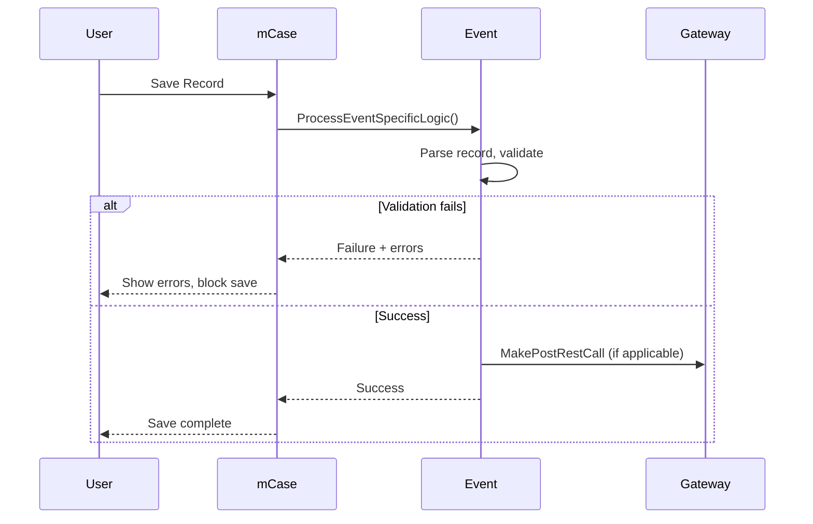

# Event Model

All custom events in the Financials module follow a consistent pattern defined by the mCase Custom Events framework.

## Base Class: AMCaseValidateCustomEvent

Events extend `AMCaseValidateCustomEvent` and override specific members.

### Required Overrides

```csharp
public override string PrefixName => "[NMImpact] Financials";
public override string ExactName => "Descriptive Event Name";

protected override List<EventTrigger> ValidEventTriggers => new List<EventTrigger>
{
    EventTrigger.PostCreate,  // and/or PostUpdate, PreUpdate
};

protected override EventReturnObject ProcessEventSpecificLogic(
    AEventHelper eventHelper,
    UserData triggeringUser,
    WorkFlowData workflow,
    RecordInstanceData recordInsData,
    RecordInstanceData preSaveRecordData,
    Dictionary<string, DataListData> datalistsBySystemName,
    Dictionary<string, Dictionary<string, FieldData>> fieldsBySystemNameByListName,
    string triggerType)
{
    // 1. Parse record to typed entity
    if (!recordInsData.TryParseRecord(eventHelper, out F_invoice invoiceRecord))
        return new EventReturnObject(EventStatusCode.Failure, ...);

    // 2. Check trigger conditions (e.g., status change)
    if (invoiceStatus != F_invoiceStatic.DefaultValues.Paid)
        return new EventReturnObject(EventStatusCode.Success);

    // 3. Execute business logic
    // ...

    // 4. Return result
    return new EventReturnObject(EventStatusCode.Success);
}
```

### Optional Overrides

- **SpecificFieldSystemNamesByListSystemName** — Limit event to specific field changes
- **NeededRelationships** — Load related data
- **RecordDatalistType** — Restrict to specific data list types

## EventReturnObject

Return value for event processing:

- **Status**: `EventStatusCode.Success` or `EventStatusCode.Failure`
- **Messages**: User-facing messages
- **Errors**: Error messages (block save on failure)

## Event Execution Flow



## Event Index by Category

See [Event Index](../reference/event-index) for a complete list of all 50+ events in the module.
