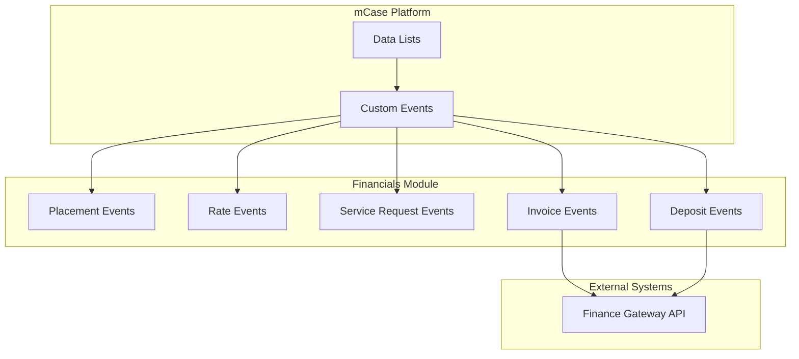

# Architecture Overview

The Financials module follows an **event-driven architecture** built on the mCase Custom Events framework. Business logic is encapsulated in custom event handlers that execute in response to data list operations (create, update).

## High-Level Architecture

## Event Model

All custom events extend `AMCaseValidateCustomEvent` and implement:

- **PrefixName** — `[NMImpact] Financials`
- **ExactName** — Descriptive event name
- **ValidEventTriggers** — `PostCreate`, `PostUpdate`, `PreUpdate`
- **ProcessEventSpecificLogic** — Core business logic

### Event Trigger Types

| Trigger | When Fired | Typical Use |
|---------|------------|-------------|
| `PostCreate` | After record insert | Create related records, call gateway |
| `PostUpdate` | After record update | Sync state, update related records |
| `PreUpdate` | Before record update | Validation, prevent invalid changes |

## Data Flow

1. **User Action** → User creates/updates a record in mCase (e.g., Placement, Invoice)
2. **Event Trigger** → mCase fires registered custom events
3. **Event Logic** → Event handler executes business logic
4. **Side Effects** → May create/update other records, call Finance Gateway
5. **Response** → `EventReturnObject` with success/failure and messages

## Key Design Patterns

### 1. Validation Before Action

Pre-update events validate data before persistence. Post events perform actions after data is committed.

### 2. Gateway Abstraction

`FinanceServices.MakePostRestCall()` abstracts HTTP communication with the Finance Gateway. Message types (`AMessage`, `ManageFundsMessage`, etc.) provide a clean contract.

### 3. Placement-to-Service Mapping

`NMFinancialConstants.requiredServiceMap` maps placement settings and types to required service catalog codes. This enables automatic service authorization creation.

### 4. Approval Chain

Service requests use a configurable approval chain (Supervisor → Manager → Associate Deputy Director → Deputy Director) defined in the Service Catalog.

For a detailed view of how entities connect (Fund → Fund Balance → Deposits, Service Catalog → Funding Model → Fund Allocation, etc.), see [Data Model Architecture](data-model).

## Dependencies

- **MCaseEventsSDK** — Event framework, data access, ORM
- **MCaseCustomEvents.CommonUtilities** — Shared utilities
- **Newtonsoft.Json** — JSON serialization for gateway calls
- **System.Net.Http** — HTTP client for REST API
